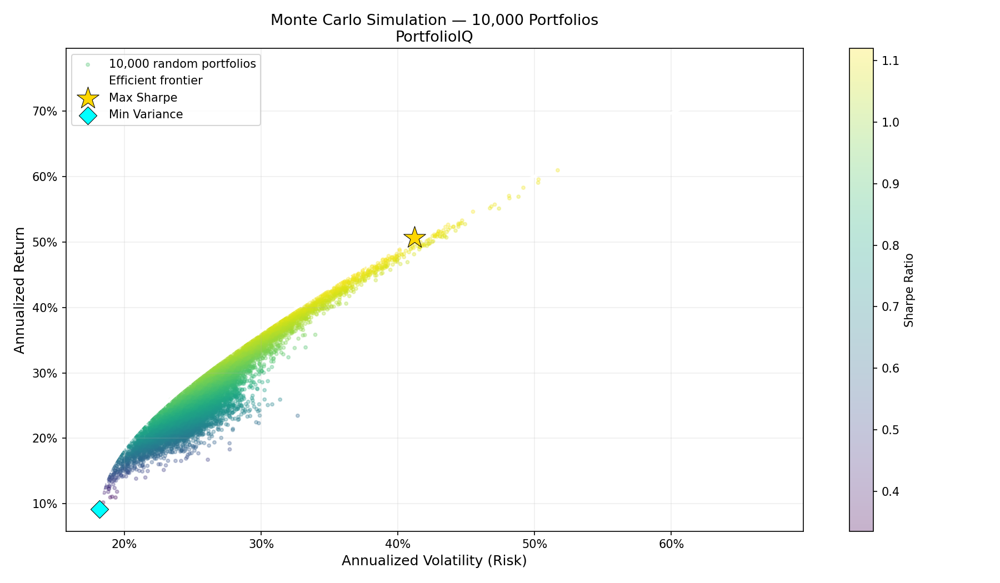
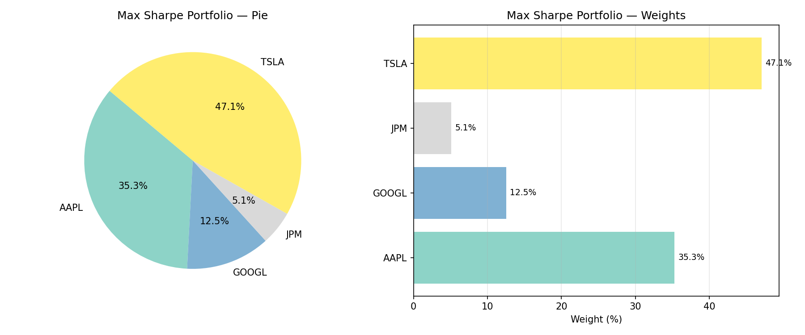
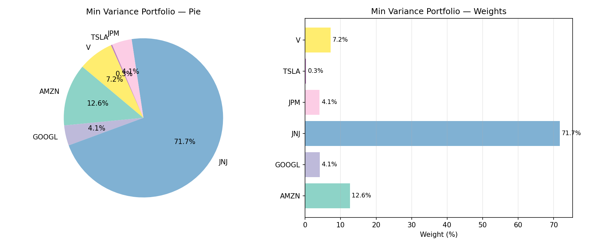
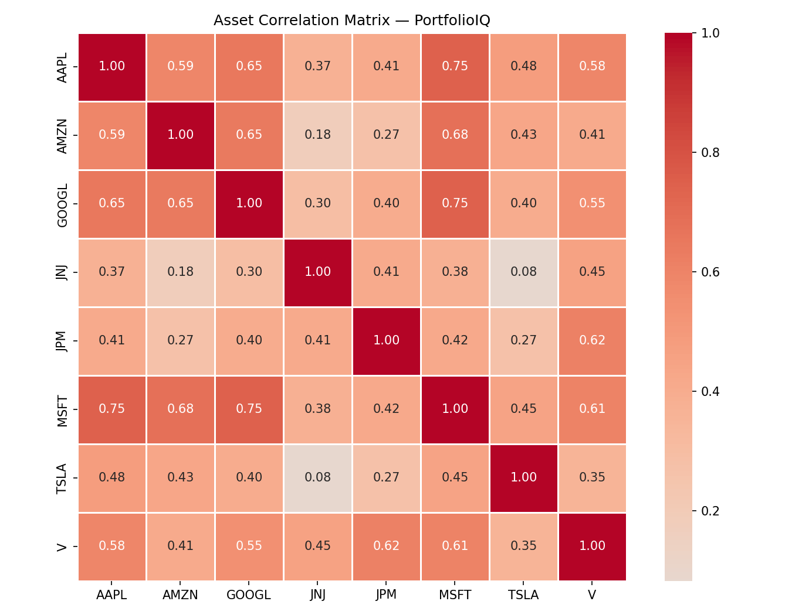
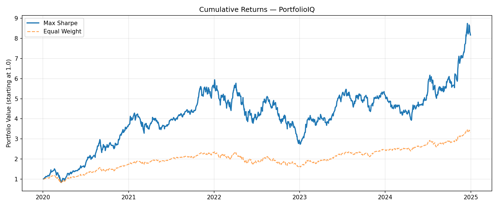

# PortfolioIQ — Portfolio Optimization Engine

A quantitative portfolio optimization engine built on **Modern Portfolio Theory (Markowitz model)**.
Given a set of equities, PortfolioIQ analyzes 5 years of historical data to find the optimal
asset allocation that maximizes risk-adjusted return.



---

## What it does

- Fetches and caches historical price data via `yfinance`
- Computes annualized returns and a covariance matrix from daily returns
- Solves the Markowitz optimization problem using `scipy.optimize` (SLSQP)
- Finds two key portfolios: **Maximum Sharpe Ratio** and **Minimum Variance**
- Traces the full **Efficient Frontier** across 100 target return levels
- Runs a **Monte Carlo simulation** of 10,000 random portfolios to visualize the opportunity space
- Computes risk metrics: Sharpe, Sortino, Max Drawdown, Value at Risk (95%)
- Exports optimal allocations to JSON

---

## Results (2020–2024, 8 equities)

| Metric | Max Sharpe | Min Variance |
|---|---|---|
| Annual Return | 50.68% | 9.16% |
| Annual Volatility | 41.20% | 18.17% |
| Sharpe Ratio | 1.13 | 0.28 |
| Sortino Ratio | 1.61 | 0.38 |
| Max Drawdown | -53.95% | -25.90% |
| VaR (95%) | -3.87% | -1.68% |

### Max Sharpe allocation


### Min Variance allocation


### Asset correlation matrix


### Cumulative returns vs equal-weight benchmark


---

## Project structure

PortfolioIQ/
├── src/
│   ├── data_loader.py     # yfinance fetch + local caching
│   ├── returns.py         # daily/annual returns, covariance matrix
│   ├── optimizer.py       # Markowitz solver, efficient frontier, max Sharpe
│   ├── metrics.py         # Sharpe, Sortino, max drawdown, VaR
│   ├── visualizer.py      # matplotlib/seaborn plots
│   ├── monte_carlo.py     # 10,000 portfolio simulation
│   └── report.py          # JSON export
├── data/                  # cached price data
├── outputs/
│   ├── plots/             # all generated figures
│   └── reports/           # optimal allocation JSON files
├── notebooks/             # EDA and walkthrough notebooks
├── config.yaml            # tickers, date range, parameters
└── main.py                # single entry point


---

## Quickstart

```bash
git clone https://github.com/YOUR_USERNAME/PortfolioIQ.git
cd PortfolioIQ
python -m venv venv && source venv/bin/activate
pip install -r requirements.txt
python main.py
```

To change the stock universe, edit `config.yaml`:

```yaml
portfolio:
  tickers: [AAPL, MSFT, GOOGL, AMZN, TSLA, JPM, JNJ, V]
  start_date: "2020-01-01"
  end_date: "2024-12-31"
```

---

## Tech stack

| Tool | Purpose |
|---|---|
| `yfinance` | Historical OHLCV data |
| `numpy` / `scipy` | Markowitz optimization (SLSQP) |
| `pandas` | Data wrangling |
| `matplotlib` / `seaborn` | Visualization |

---

## Key concepts

**Modern Portfolio Theory** — Harry Markowitz (1952) showed that for any level of risk,
there exists an optimal portfolio that maximizes expected return. The set of all such
portfolios forms the efficient frontier.

**Sharpe Ratio** — measures return per unit of risk: `(R - Rf) / σ`.
A ratio above 1.0 is generally considered strong.

**Monte Carlo simulation** — 10,000 randomly weighted portfolios are generated to
visualize the full opportunity space. The efficient frontier forms the upper boundary
of this cloud.

---

*Part of a three-project finance + ML portfolio: PortfolioIQ → LoanLens → StockSense*
